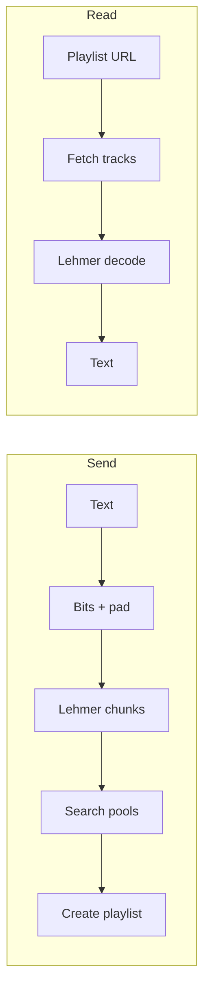

# Phantom Tracks

A **static, client-only** web app that hides short text inside **Spotify playlists** using **duration-ranked Lehmer coding** (44 bits per block of 16 tracks). Recipients sign in with Spotify, paste a playlist link, and the original message is recovered—as long as the playlist order is unchanged.

**Architecture (by design):** Encoding, decoding, and all Spotify orchestration (OAuth with PKCE, search, playlist read/write) run **entirely in the browser**. This repository does **not** include an application server, database, or API of its own—the **only** remote service the client talks to is **Spotify’s Web API**. That is a deliberate tradeoff: static hosting, no server to operate for this product, and alignment with Spotify’s **Authorization Code with PKCE** model without putting a client secret in client-side code.

This repository is the product UI and logic only. Marketing or documentation sites can live elsewhere; the first screen here is a compact connect + usage gate.

---

## Table of contents

- [Features](#features)
- [How it works](#how-it-works)
- [Tech stack](#tech-stack)
- [Prerequisites](#prerequisites)
- [Quick start](#quick-start)
- [Environment variables](#environment-variables)
- [Spotify Developer Dashboard](#spotify-developer-dashboard)
- [OAuth and tokens](#oauth-and-tokens)
- [Project layout](#project-layout)
- [Scripts](#scripts)
- [Production build and hosting](#production-build-and-hosting)
- [Limitations and security](#limitations-and-security)
- [Spotify policy and API notes](#spotify-policy-and-api-notes)
- [Troubleshooting](#troubleshooting)

---

## Features

- **Send:** UTF-8 text (byte budget enforced in UI), genre seed for track search, optional playlist name; creates a new playlist on the signed-in account with an agreed description marker.
- **Read:** Accepts playlist URL, `spotify:playlist:` URI, or raw playlist id; validates track count and decodes.
- **Spotify Web API** with [Authorization Code + PKCE](https://developer.spotify.com/documentation/web-api/tutorials/code-pkce-flow) (no first-party backend; no client secret in the browser).
- **Resilient HTTP:** refresh on `401`, honors `Retry-After` / backoff on `429`.
- **UI:** Dark editorial styling (serif + sans + mono), single-screen connect gate, mode select, send/read flows.

---

## How it works

1. **Text → bits:** A 16-bit header stores the Unicode code-point count, followed by UTF-8 bytes. The bitstream is padded to a multiple of **44 bits** (one “chunk” per 16 songs).
2. **Bits → permutation:** Each 44-bit integer is interpreted as a **Lehmer code** over 16 tracks that have **pairwise distinct** `duration_ms` values (ranked shortest → longest). The resulting track order is the encoding for that chunk.
3. **Playlist write:** Chunks are concatenated; tracks are added with `POST /v1/playlists/{id}/items` in batches of **100**, **sequentially** (order must not interleave).
4. **Decode:** Tracks are read in order, split into groups of 16; Lehmer is inverted; bits are reassembled; text is recovered using the header length.

All Lehmer factorial arithmetic uses **`bigint`** to avoid silent `Number` overflow past 2^53.



---

## Tech stack

| Layer | Choice |
|--------|--------|
| UI | React 19, TypeScript |
| Build | Vite 8 |
| Styling | Global CSS (design tokens in `src/index.css`) |
| API | Spotify Web API `v1` via `fetch` |

No database, no server runtime in this repo.

---

## Prerequisites

- **Node.js** 20+ (LTS recommended) and npm.
- A **Spotify account** and an app registered on the [Spotify Developer Dashboard](https://developer.spotify.com/dashboard).
- For **Development mode** apps, Spotify currently requires an **active Premium** subscription on the **account that owns the app**, and may restrict how many users can authorize the app. See [February 2026 Web API Dev Mode changes](https://developer.spotify.com/documentation/web-api/tutorials/february-2026-migration-guide) and [quota modes](https://developer.spotify.com/documentation/web-api/concepts/quota-modes).

---

## Quick start

```bash
git clone https://github.com/<you>/PhantomTracks.git
cd PhantomTracks
npm install
cp .env.example .env
```

Edit `.env` with your **Client ID** and a **Redirect URI** that exactly matches what you configured in the Spotify app (including scheme, host, path, and port).

Local dev uses **`http://127.0.0.1:5173/callback`** (see `vite.config.ts`: server binds to `127.0.0.1`). Spotify does not allow `http://localhost` for new redirect URIs per their [redirect URI rules](https://developer.spotify.com/documentation/web-api/concepts/redirect_uri).

```bash
npm run dev
```

Open the URL printed in the terminal (typically `http://127.0.0.1:5173/`), then **Connect with Spotify**.

---

## Environment variables

| Variable | Required | Description |
|----------|----------|-------------|
| `VITE_SPOTIFY_CLIENT_ID` | Yes | OAuth **Client ID** from the Spotify app (safe to expose in the frontend). |
| `VITE_SPOTIFY_REDIRECT_URI` | Yes | Must match **one** redirect URI in the dashboard character-for-character (e.g. `http://127.0.0.1:5173/callback` for local dev, or your deployed `https://…/callback`). |

**Never** commit `.env` or a client secret. This app does not use a client secret in the browser (PKCE only).

---

## Spotify Developer Dashboard

1. Create an app and note the **Client ID**.
2. **Redirect URIs:** Add the same value as `VITE_SPOTIFY_REDIRECT_URI` (production must use **HTTPS** except `http://127.0.0.1` for local development).
3. **Users and access:** While the app is in Development mode, add any Spotify user who will test the app (unless they are the dashboard owner—see Spotify’s current rules).
4. Requested **scopes** (defined in `src/spotify/authConfig.ts`): `user-read-private`, `user-read-email`, `playlist-modify-public`, `playlist-modify-private`, `playlist-read-private`.

Official references:

- [Web API documentation](https://developer.spotify.com/documentation/web-api)
- [Authorization Code with PKCE](https://developer.spotify.com/documentation/web-api/tutorials/code-pkce-flow)
- [OpenAPI schema](https://developer.spotify.com/reference/web-api/open-api-schema.yaml)

---

## OAuth and tokens

- **PKCE:** A code verifier is stored in `sessionStorage` only for the redirect round-trip; access and refresh tokens are kept in memory and `sessionStorage` (refresh + expiry metadata) per `src/spotify/tokens.ts`.
- After changing scopes, users may need to **remove the app** under Spotify account **Manage apps** and sign in again so consent includes the new scopes.

---

## Project layout

```
src/
  App.tsx                 # Boot, OAuth callback handling, screen routing
  main.tsx
  index.css               # Global layout and theme
  codec/                  # Bitstream + Lehmer (BigInt)
  spotify/                # PKCE, tokens, HTTP wrapper, playlist + search APIs
  phantom/                # Encode/decode orchestration, playlist id parsing
  ui/                     # Landing (connect gate), mode select, send, read
  genres.ts               # Genre list for search seeds
public/
  favicon.svg
```

---

## Scripts

| Command | Purpose |
|---------|---------|
| `npm run dev` | Start Vite dev server (`127.0.0.1:5173`). |
| `npm run build` | Typecheck (`tsc -b`) and production bundle to `dist/`. |
| `npm run preview` | Serve the production build locally. |
| `npm run lint` | Run ESLint. |

---

## Production build and hosting

```bash
npm run build
```

Deploy the **`dist/`** folder to any static host (Netlify, Vercel, GitHub Pages, S3 + CloudFront, etc.).

**Checklist for production:**

1. Set `VITE_SPOTIFY_REDIRECT_URI` to your **public HTTPS** callback URL (e.g. `https://yourdomain.com/callback`).
2. Add that exact URI in the Spotify app settings.
3. Rebuild so Vite bakes the env vars into the client bundle.

Search and other limits may change with Spotify’s roadmap (e.g. [February 2026 migration guide](https://developer.spotify.com/documentation/web-api/tutorials/february-2026-migration-guide)); adjust `src/spotify/searchPools.ts` if limits or endpoints change.

---

## Limitations and security

- **Not encryption:** Anyone who knows to use this tool and has the playlist can decode the payload. For real secrecy, encrypt text **before** pasting it in.
- **Playlist integrity:** Reordering, adding, or removing tracks corrupts the message.
- **Message size:** UI enforces a UTF-8 byte budget (see `MAX_UTF8_BYTES` in `src/codec/textBits.ts`).
- **Steganography, not security through obscurity alone:** Treat playlists as an encoding channel, not a vault.

---

## Spotify policy and API notes

- Prefer current endpoints (e.g. `POST /v1/playlists/{id}/items` for adding tracks). Deprecated paths are avoided where documented.
- Rate limits: the client backs off on `429` and respects `Retry-After` when present.
- **Premium / quota:** Behavior depends on Spotify’s policies for your app’s **quota mode** and account type; see official docs above—do not rely on this README as legal or commercial advice.

---

## Troubleshooting

| Symptom | Things to check |
|---------|------------------|
| `redirect_uri` mismatch | Dashboard URI and `VITE_SPOTIFY_REDIRECT_URI` must match exactly (trailing slash, `http` vs `https`, `127.0.0.1` vs `localhost`). |
| `403` / “owner” / Premium | Dashboard **owner** account needs **Premium** for Development-mode rules; propagation after plan changes can take hours. |
| `403` / “not registered” | Add the Spotify user under the app’s **User Management** in Development mode. |
| PKCE verifier missing | Usually a second navigation consumed the code; try Connect again from a clean tab. |
| Decode fails | Track count must be ≥ 32 and a multiple of 16; playlist must not have been edited. |

---

## License

Specify your license in a `LICENSE` file (e.g. MIT) when you publish; this README does not impose one by default.
