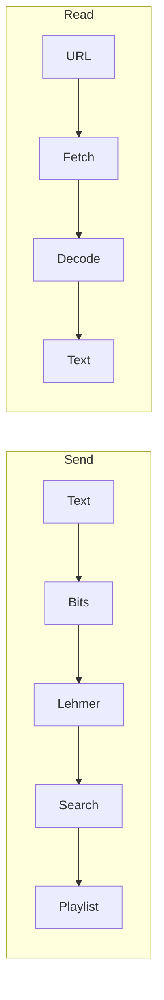

# Phantom Tracks

Static single-page app that encodes UTF-8 text into **Spotify playlist track order** using **duration-ranked Lehmer coding** (44 bits per block of 16 tracks). Someone with the playlist link and this app can decode the message **only if** Spotify’s stored order is unchanged.

Everything runs in the **browser**: OAuth (PKCE), search, playlist create/read, encode, and decode. There is **no** backend in this repo—only [Spotify’s Web API](https://developer.spotify.com/documentation/web-api).

---

## Contents

- [Features](#features)
- [How it works](#how-it-works)
- [Tech stack](#tech-stack)
- [Prerequisites](#prerequisites)
- [Setup](#setup)
- [OAuth](#oauth)
- [Web API behavior](#web-api-behavior)
- [Project layout](#project-layout)
- [Scripts](#scripts)
- [Production](#production)
- [Limitations](#limitations)
- [Troubleshooting](#troubleshooting)
- [License](#license)

---

## Features

- **Send:** Message (UTF-8 byte limit in UI), genre seed for `/search`, playlist name, optional **playlist description**. After success: open/copy link and a **listening-order** preview (title, artist, duration, album art when the API returns it).
- **Read:** Playlist URL, `spotify:playlist:` URI, or raw id → decode and copy message; same preview panel on success.
- **Playlist description:** Empty field → default line starting with **🔐 Phantom Tracks** (do not reorder). Non-empty → **exactly** your trimmed text, up to **300 UTF-8 bytes** client-side.
- **HTTP:** Refresh on `401`; backoff and `Retry-After` on `429`.

---

## How it works

1. **Bits:** 16-bit character count header + UTF-8 payload; pad to a multiple of **44 bits** per chunk.
2. **Lehmer:** Each 44-bit value maps to a permutation of 16 tracks with **distinct** `duration_ms` (rank by duration, `bigint` arithmetic).
3. **Write:** `POST /v1/playlists/{id}/items` in batches of up to **100** URIs, **one batch after another** (order preserved).
4. **Read:** `GET` playlist items in order → groups of 16 → invert Lehmer → reconstruct text.



---

## Tech stack

React 19, TypeScript, Vite 8, global CSS (`src/index.css`), `fetch` to Spotify Web API `v1`.

---

## Prerequisites

- Node.js **20+** and npm.
- A Spotify app in the [Developer Dashboard](https://developer.spotify.com/dashboard).
- Development-mode apps may require **Premium** on the **dashboard owner** account and explicit **User Management** entries for testers—check Spotify’s current Web API and quota docs.

---

## Setup

```bash
cd PhantomTracks
npm install
cp .env.example .env
```

Edit `.env`:

| Variable | Description |
|----------|-------------|
| `VITE_SPOTIFY_CLIENT_ID` | Spotify app **Client ID** (safe in a SPA). |
| `VITE_SPOTIFY_REDIRECT_URI` | Must match one dashboard redirect URI exactly. |

**Local dev:** `vite.config.ts` binds the dev server to **`127.0.0.1:5173`**. Use a redirect like **`http://127.0.0.1:5173/callback`** (Spotify’s rules disallow `http://localhost` for new URIs—see their [redirect URI documentation](https://developer.spotify.com/documentation/web-api/concepts/redirect_uri)).

**Dashboard:** Register that URI; for production use **HTTPS** on your real host. Add test users under **User Management** when the app is in Development mode if required.

**Scopes** (`src/spotify/authConfig.ts`): `user-read-private`, `user-read-email`, `playlist-modify-public`, `playlist-modify-private`, `playlist-read-private`.

Do not commit `.env`. No client secret is used (PKCE only).

```bash
npm run dev
```

Open the printed local URL and connect with Spotify.

---

## OAuth

- **PKCE:** Code verifier in `sessionStorage` for the redirect round-trip only.
- **Tokens:** Access token in memory; refresh token and access-expiry metadata in `sessionStorage` (`src/spotify/tokens.ts`).
- After **scope** changes, users may need to remove the app under Spotify **Manage apps** and sign in again.

---

## Web API behavior

Aligned with Spotify’s [OpenAPI schema](https://developer.spotify.com/reference/web-api/open-api-schema.yaml) where it matters for this client:

| Topic | Implementation |
|--------|------------------|
| Search | `GET /search` with `limit` **≤ 10**; offset paging per schema. |
| Playlist read | `GET /playlists/{id}/items`, `limit` **≤ 50**, `market=from_token`, offset paging using **`total`** (not only `next`). Rows read from **`item`**, with fallback to deprecated **`track`**. |
| Read fallbacks | If `items` returns `403`, deprecated `/tracks` paging or `GET /playlists/{id}` with `tracks.*` fields may be used. |
| Create playlist | `description` capped at **300 UTF-8 bytes** before send. |

---

## Project layout

```
src/
  App.tsx           # OAuth callback, routing
  main.tsx
  index.css
  codec/            # Bits, UTF-8 header, Lehmer (BigInt)
  spotify/          # PKCE, tokens, HTTP, playlists, search
  phantom/          # Encode/decode, playlist id parsing
  ui/               # Screens + playlist preview
  genres.ts
public/
  favicon.svg
```

---

## Scripts

| Command | Purpose |
|---------|---------|
| `npm run dev` | Dev server (`127.0.0.1:5173`). |
| `npm run build` | Typecheck + `dist/` bundle. |
| `npm run preview` | Serve `dist/` locally. |
| `npm run lint` | ESLint. |

---

## Production

```bash
npm run build
```

Deploy `dist/` to any static host. Set `VITE_SPOTIFY_REDIRECT_URI` to your **HTTPS** callback, register it on the Spotify app, then rebuild.

---

## Limitations

- **Not encryption**—protect sensitive text before encoding if needed.
- **Fragile to edits**—any reorder, add, or remove breaks the message.
- **Message length**—UI enforces a UTF-8 cap on the secret (`src/codec/textBits.ts`).
- **Rate limits and quotas**—depend on Spotify; the client backs off on `429` but cannot bypass account or policy restrictions.

---

## Troubleshooting

| Issue | Check |
|-------|--------|
| `redirect_uri` mismatch | URI in dashboard and `.env` match exactly (`https` vs `http`, path, `127.0.0.1` vs `localhost`). |
| `403` / Premium / not registered | Owner Premium (dev mode), **User Management** list, official Spotify docs. |
| PKCE verifier missing | Retry connect from a clean tab. |
| Invalid limit (send) | Search `limit` must follow current OpenAPI (`src/spotify/searchPools.ts`). |
| Forbidden / empty tracks (read) | Scopes; `market=from_token`; reconnect after scope changes. |
| “Doesn’t look like a Phantom Tracks playlist” | Playable tracks with `duration_ms` must count **≥ 16** and be a **multiple of 16**; playlist must be unedited. |
| Garbled decode | Order or track set no longer matches what was written. |

---

## License

[MIT](LICENSE)

