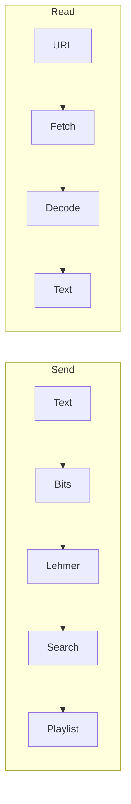

# Phantom Tracks

Static single-page app that encodes UTF-8 text into **Spotify playlist track order** using **duration-ranked Lehmer coding** (44 bits per block of 16 tracks). Someone with the playlist link and this app can decode the message **only if** Spotify’s stored order is unchanged.

Everything runs in the **browser**: OAuth (PKCE), search, playlist create/read, encode, and decode. There is **no** backend in this repo—only [Spotify’s Web API](https://developer.spotify.com/documentation/web-api).

---

## Contents

- [Features](#features)
- [How it works](#how-it-works)
- [Tech stack](#tech-stack)
- [Prerequisites](#prerequisites)
- [Spotify developer mode and local setup](#spotify-developer-mode-and-local-setup)
- [Access requests (development mode)](#access-requests-development-mode)
- [Setup](#setup)
- [OAuth](#oauth)
- [Web API behavior](#web-api-behavior)
- [Project layout](#project-layout)
- [Scripts](#scripts)
- [Testing](#testing)
- [Production](#production)
- [Limitations](#limitations)
- [Troubleshooting](#troubleshooting)
- [License](#license)

---

## Features

- **Send:** Message (UTF-8 byte limit in UI), genre seed for `/search`, playlist name, optional **playlist description**. After success: open/copy link and a **listening-order** preview (title, artist, duration, album art when the API returns it).
- **Read:** Playlist URL, `spotify:playlist:` URI, or raw id → decode and copy message; same preview panel on success.
- **Playlist description:** Empty field → default line starting with **🔐 Phantom Tracks** (do not reorder). Non-empty → **exactly** your trimmed text, up to **300 UTF-8 bytes** client-side.
- **HTTP:** Refresh on `401`; backoff and `Retry-After` on `429`.
- **Development mode:** If the Spotify API rejects an account after sign-in (allowlist), visitors can use an **access request** form; see [Access requests](#access-requests-development-mode).

---

## How it works

1. **Bits:** 16-bit character count header + UTF-8 payload; pad to a multiple of **44 bits** per chunk.
2. **Lehmer:** Each 44-bit value maps to a permutation of 16 tracks with **distinct** `duration_ms` (rank by duration, `bigint` arithmetic).
3. **Write:** `POST /v1/playlists/{id}/items` in batches of up to **100** URIs, **one batch after another** (order preserved).
4. **Read:** `GET` playlist items in order → groups of 16 → invert Lehmer → reconstruct text.



---

## Tech stack

React 19, TypeScript, Vite 8, global CSS (`app/src/index.css`), `fetch` to Spotify Web API `v1`.

---

## Prerequisites

- Node.js **20+** and npm.
- A Spotify account that can use the Web API with this project, following [Spotify developer mode and local setup](#spotify-developer-mode-and-local-setup) below.

---

## Spotify developer mode and local setup

Spotify treats new API apps as being in **development mode** until they are moved to **extended quota mode** through Spotify’s own review and eligibility process. Phantom Tracks is a normal browser app on top of the Web API, so those rules apply to you if you fork this repo or create your own dashboard app.

**What development mode means (see Spotify’s [quota modes](https://developer.spotify.com/documentation/web-api/concepts/quota-modes)):**

- **User cap:** Only a small number of Spotify users (documented as **up to five**) are supported for real API use. Each person must be listed under your app’s **Settings → User Management** in the [Developer Dashboard](https://developer.spotify.com/dashboard) before they rely on the app.
- **Premium on the app owner:** Spotify documents that the **owner of the dashboard app** must have **Spotify Premium** while the app remains in development mode.
- **Allowlist vs sign-in:** Someone who is **not** on User Management may still complete the OAuth screen, but **API calls with their session can return `403`**. If a friend hits that, add their Spotify account email in User Management (until the cap is reached).
- **Public “anyone can use it” hosting:** Opening your build to the whole internet does **not** bypass development mode. Broader access requires **extended quota mode** and Spotify’s partner-style process; criteria tightened over time (see Spotify’s [Web API policy and blog posts](https://developer.spotify.com/blog/2025-04-15-updating-the-criteria-for-web-api-extended-access)). For a personal fork, plan on **you plus a handful of listed testers**, not unlimited anonymous users.

**Run the app locally with your own Spotify app**

1. **Spotify account with Premium** on the account that will **own** the Developer Dashboard app (Individual Premium, or a plan Spotify treats as Premium for this purpose—confirm against Spotify’s current docs).
2. Log in at [developer.spotify.com/dashboard](https://developer.spotify.com/dashboard) with that account.
3. **Create app** → note the **Client ID**. You do not need a client secret for this repo (PKCE only).
4. **Redirect URIs:** add **`http://127.0.0.1:5173/callback`** exactly (this repo’s Vite dev server uses `127.0.0.1`; Spotify often rejects plain `http://localhost` for new redirect URIs).
5. **User Management:** add **your** Spotify email (and any testers, up to Spotify’s documented limit).
6. Clone this repository, then from the **`app/`** directory:

   ```bash
   cd app
   npm install
   cp .env.example .env
   ```

7. Edit **`app/.env`**:

   | Variable | Value |
   |----------|--------|
   | `VITE_SPOTIFY_CLIENT_ID` | Your app’s Client ID. |
   | `VITE_SPOTIFY_REDIRECT_URI` | `http://127.0.0.1:5173/callback` (must match the dashboard entry exactly). |

8. Start the dev server and open the URL Vite prints (typically **`http://127.0.0.1:5173`**):

   ```bash
   npm run dev
   ```

9. Use **Connect** / sign in with Spotify in the UI. Use an account that is on **User Management** if you are still in development mode.

For a **deployed** site, register an **HTTPS** redirect URI (for example `https://your-project.vercel.app/callback`), set the same value as `VITE_SPOTIFY_REDIRECT_URI` in your host’s environment variables, and rebuild. You still need User Management entries for each tester while the app stays in development mode.

### Access requests (development mode)

If Spotify allows sign-in but then **blocks the Web API** for an account that is not on **User Management** (typical in development mode), the app shows a **request access** form instead of dumping raw API errors.

- **What the visitor sees:** A short explanation plus fields for name, Spotify email, and an optional message.
- **What you receive:** The same details plus **technical context** from Spotify (for debugging) in the body of the notification.
- **Delivery (no backend in this repo):**
  - Set **`VITE_WEB3FORMS_ACCESS_KEY`** in **`app/.env`** (local) or your host’s env (e.g. Vercel), then rebuild. Create a free key at [web3forms.com](https://web3forms.com) tied to the inbox where you want requests.
  - If that variable is **unset**, the app opens a **mailto** with a prefilled message. The default recipient is defined as **`ACCESS_REQUEST_MAILTO`** in `app/src/accessRequest.ts`—change it if you fork the project.

---

## Setup

```bash
cd app
npm install
cp .env.example .env
```

Edit **`app/.env`** (same variables as in [Spotify developer mode and local setup](#spotify-developer-mode-and-local-setup)):

| Variable | Description |
|----------|-------------|
| `VITE_SPOTIFY_CLIENT_ID` | Spotify app **Client ID** (safe in a SPA). |
| `VITE_SPOTIFY_REDIRECT_URI` | Must match one dashboard redirect URI exactly. |
| `VITE_WEB3FORMS_ACCESS_KEY` | Optional. [Web3Forms](https://web3forms.com) access key so the **access request** form can email you without a `mailto` fallback. See [Access requests](#access-requests-development-mode). |

**Local dev:** `app/vite.config.ts` binds the dev server to **`127.0.0.1:5173`**. Prefer **`http://127.0.0.1:5173/callback`** in the dashboard and in `.env` (Spotify often rejects plain `http://localhost` for new redirect URIs—see their [redirect URI documentation](https://developer.spotify.com/documentation/web-api/concepts/redirect_uri)).

**Scopes** (`app/src/spotify/authConfig.ts`): `user-read-private`, `user-read-email`, `playlist-modify-public`, `playlist-modify-private`, `playlist-read-private`.

Do not commit `.env`. No client secret is used (PKCE only).

```bash
npm run dev
```

Open the printed local URL (typically `http://127.0.0.1:5173`) and sign in with an account allowed to use your Spotify app (see User Management in the section above).

---

## OAuth

- **PKCE:** Code verifier in `sessionStorage` for the redirect round-trip only.
- **Tokens:** Access token in memory; refresh token and access-expiry metadata in `sessionStorage` (`app/src/spotify/tokens.ts`).
- After **scope** changes, users may need to remove the app under Spotify **Manage apps** and sign in again.

---

## Web API behavior

Aligned with Spotify’s [OpenAPI schema](https://developer.spotify.com/reference/web-api/open-api-schema.yaml) where it matters for this client:

| Topic | Implementation |
|--------|------------------|
| Search | `GET /search` with `limit` **≤ 10**; offset paging per schema. |
| Playlist read | `GET /playlists/{id}/items`, `limit` **≤ 50**, `market=from_token`, offset paging using **`total`** (not only `next`). Rows read from **`item`**, with fallback to deprecated **`track`**. |
| Read fallbacks | If `items` returns `403`, deprecated `/tracks` paging or `GET /playlists/{id}` with `tracks.*` fields may be used. |
| Create playlist | `description` capped at **300 UTF-8 bytes** before send. |

---

## Project layout

Application code lives under **`app/`**:

```
app/
  src/
    App.tsx           # OAuth callback, routing
    main.tsx
    index.css
    codec/            # Bits, UTF-8 header, Lehmer (BigInt)
    spotify/          # PKCE, tokens, HTTP, playlists, search
    phantom/          # Encode/decode, playlist id parsing
    ui/               # Screens + playlist preview
    tests/            # Vitest (`*.test.ts`) — codec, Spotify helpers, mocked flows
    genres.ts
  public/
    favicon.svg
```

---

## Scripts

Run these from the **`app/`** directory:

| Command | Purpose |
|---------|---------|
| `npm run dev` | Dev server (`127.0.0.1:5173`). |
| `npm run build` | Typecheck + `dist/` bundle. |
| `npm run preview` | Serve `dist/` locally. |
| `npm run lint` | ESLint. |
| `npm test` | Vitest once (no Spotify account needed). |
| `npm run test:watch` | Vitest watch mode. |

---

## Testing

[Vitest](https://vitest.dev/) drives unit tests under `app/src/tests/` (codec, Lehmer, playlist parsing, PKCE/token helpers, error parsing, and mocked decode). They do **not** call the live Spotify API.

---

## Production

```bash
cd app
npm run build
```

From **`app/`**, deploy `app/dist/` to any static host. Set `VITE_SPOTIFY_REDIRECT_URI` to your **HTTPS** callback, register it on the Spotify app, then rebuild.

---

## Limitations

- **Not encryption**—protect sensitive text before encoding if needed.
- **Fragile to edits**—any reorder, add, or remove breaks the message.
- **Message length**—UI enforces a UTF-8 cap on the secret (`app/src/codec/textBits.ts`).
- **Rate limits and quotas**—depend on Spotify; the client backs off on `429` but cannot bypass account or policy restrictions.

---

## Troubleshooting

| Issue | Check |
|-------|--------|
| `redirect_uri` mismatch | URI in dashboard and `.env` match exactly (`https` vs `http`, path, `127.0.0.1` vs `localhost`). |
| `403` / Premium / not registered | Owner Premium (dev mode), **User Management** list, official Spotify docs. |
| PKCE verifier missing | Retry connect from a clean tab. |
| Invalid limit (send) | Search `limit` must follow current OpenAPI (`app/src/spotify/searchPools.ts`). |
| Forbidden / empty tracks (read) | Scopes; `market=from_token`; reconnect after scope changes. |
| “Doesn’t look like a Phantom Tracks playlist” | Playable tracks with `duration_ms` must count **≥ 16** and be a **multiple of 16**; playlist must be unedited. |
| Garbled decode | Order or track set no longer matches what was written. |

---

## License

[MIT](app/LICENSE)

